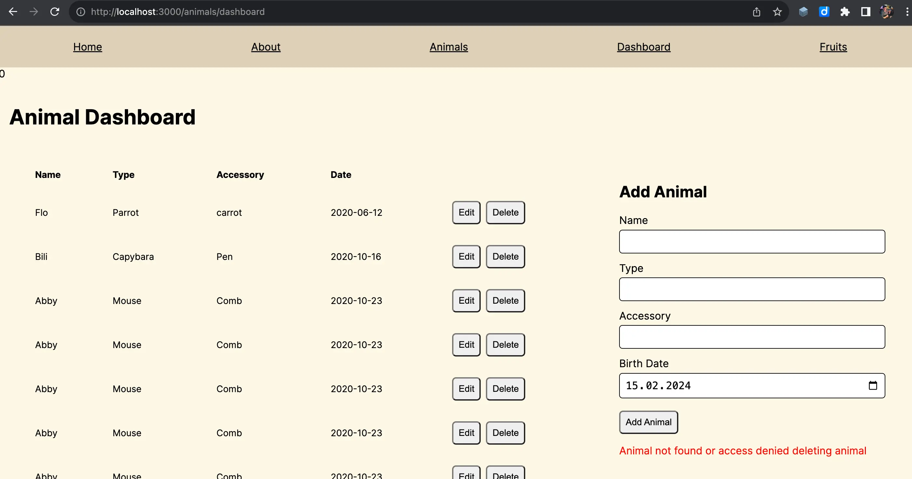

# Next.js Example - Winter 2024

The Next.js Example - Winter 2024 is a project that demonstrates how to use Next.js to build a full-stack web application. It is part of the curriculum for the [UpLeveled Web Development Bootcamp](https://upleveled.io/web-development-bootcamp).




## Technologies

- Next.js
- Postgres.js
- Jest
- Playwright

## Database Setup

If you don't have PostgreSQL installed yet, follow the instructions from the PostgreSQL step in [UpLeveled's System Setup Instructions](https://github.com/upleveled/system-setup/blob/master/readme.md).

Copy the `.env.example` file to a new file called `.env` (ignored from Git) and fill in the necessary information.

Then, connect to the built-in `postgres` database as administrator in order to create the database:

**Windows**

If it asks for a password, use `postgres`.

```bash
psql -U postgres
```

**macOS**

```bash
psql postgres
```

**Linux**

```bash
sudo -u postgres psql
```

Once you have connected, run the following to create the database:

```sql
CREATE DATABASE <database name>;
CREATE USER <user name> WITH ENCRYPTED PASSWORD '<user password>';
GRANT ALL PRIVILEGES ON DATABASE <database name> TO <user name>;
\connect <database name>
CREATE SCHEMA <schema name> AUTHORIZATION <user name>;
```

Quit `psql` using the following command:

```bash
\q
```

On Linux, you will also need to create a Linux system user with a name matching the user name you used in the database. It will prompt you to create a password for the user - choose the same password as for the database above.

```bash
sudo adduser <user name>
```

Once you're ready to use the new user, reconnect using the following command.

**Windows and macOS:**

```bash
psql -U <user name> <database name>
```

**Linux:**

```bash
sudo -u <user name> psql -U <user name> <database name>
```

## Deployment

- Fly.io
- Docker

## Authentication

Some pages are protected with sessions and can only be accessed by authenticated users. User needs to login with username and password to be authenticated. Authenticated users can access the protected pages and perform CRUD operations on the animals.

```
export type User = {
  id: number;
  username: string;
};

export type UserWithPasswordHash = User & {
  passwordHash: string;
};

type Error = {
  message: string;
};

```

```
- /api/(auth)/register
  - POST   => User   | Error[]   (create user)

- /api/(auth)/login
  - POST   => User   | Error[]   (login user)
```
